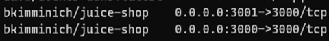

# App Delivery Manager - TechExchange UDF Lab Guide

Version 2 - 4/27/2023 7:57:01 PM

## Module 1

Learn how to create a simple HTTP deployment that securely load balances between several apps including microservices apps

## High Level Business Objective

- You work in the information technology department for a global drinks company, and you have been tasked with delivering the following critical business applications reliably, securely, and with high performance:
- **Brewz**
- **Juiceshop**

**Brewz** lives on **www.bigtechdojo.com** server, and consists of multiple microservices a shown here:

**Juiceshop** also lives on **www.bigtechdojo.com**, is containerized, but is monolithic, deployed on a single port, but there are two instances of Juiceshop on ports **3000** and **3001** as shown here:

### Diagram

### List of Components

- NMS - this is your NMS and ADM management platform. Credentials are shown in the UDF deployment-\>NMS component-\>details
- WEST-GW - this is one of your NGINX+ and NGINX-AGENT instances.
- EAST-GW - this is another
- WWW - this is a box of web servers, with one listening on port 80
- KALI - this is simply a Jumpbox. Credentials are shown in the UDF deployment-\>Kali component-\>details.
  - Access via RDP, and then do all your work from the Jumpbox.
  - This box is faster, smoother, more fun and easier than a Windows Jumpbox. Don't worry it has Firefox on it.
  - Pro Tip: When you download the RDP file, right-click and edit the file and set the resolution to 1920x1080, color depth to 24bit, username to `kali`, and enable saving username. Use `Ctrl-Shift-V` to paste.

### Detailed Requirements & Information

- The platform infrastructure team has already configured the software and hardware for you, including NGINX Management Suite, App Delivery Manager, the NGINX instances, and the application servers.

You are the application delivery team, and in that role, you will consume the platform to deliver the application. The business wants the Juice application deployed in the West, and the Brewz application deployed in the East.

Apps need to be accessed securely over the Internet at the domains as shown in the diagram.

You will know you have succeeded when you can browse securely to the West gateway and use the Brewz app, and you can browse securely to the East gateway and use the Juice app.

**You will do everything from the Kali RDP Jumpbox.**

### Spoiler Alert – Do not proceed unless you want to see the step-by-step solution

## Solution

In the NGINX Management Suite web interface, you access the App Delivery Manager (ADM) features by performing the following operations. **You will do everything from the Kali RDP Jumpbox**.

1. Log into the Kali Jumpbox via RDP password is (see UDF)
1. Start Firefox on the Kali Jumpbox
1. Click on the NMS bookmark in the bookmark bar and login as (see UDF)
1. From the Launchpad, select the **NGINX Instance Manager** card to see your instances that have already been deployed for you
1. Go back to the Launchpad
1. Select the **App Delivery Manager** card

### Create an Environment

The first resource you need to create, if one doesn't already exist, is an Environment resource. This can be accomplished by taking the following steps:

1. Select **Environments** from the **App Delivery Manager** list in the left-hand sidebar. The list of existing environments will then display.
1. Select **Create Environment** on the right-hand side of the list. A panel will appear that allows you to configure the environment.
1. Enter the value `Production` for the **Name** field. This logical environment is not just for one app, but for all your internet-facing websites. You can take the defaults for all the other fields (this exercise does not require customized templates).
1. Select **Submit** to finish creating the environment.

### Create a Gateway for Juice Shop

The gateway controls how traffic will route through an NGINX instance to get to the app workloads.

1. Select **Gateways** from the **App Delivery Manager** list in the left-hand sidebar. The list of existing gateways will then display.
1. Select **Create Gateway** on the right-hand side of the list. A panel will appear that allows you to configure the gateway.
1. From the Configuration page of Create Gateway, enter the gateway name as `West Gateway`. You can accept defaults for the next three fields.
1. For the environment field, select the environment **Production** that you previously created.
1. Select **Next** to get to the **Placements** page.
1. The platform team should have created an instance group **region-1**. From the Instance Group **Refs** dropdown, select this group. Then click **Done**.
1. Select **Next** to get to the **Hostnames** page.
1. Enter `https://west-gw.bigtechdojo.com` for the Hostname.
1. Upload the correct SSL Certificate and Key from the Kali home directory.
1. Select **Submit** to complete the Gateway

### Create your Application for Juice Shop

Follow these steps to create the applications:

1. Select **Apps** from the **App Delivery Manager** list in the left-hand sidebar. The list of existing apps will then display.
1. Select **Create App** on the right-hand side of the list. A panel will appear that allows you to configure the app.
1. Enter the value `Juice` for the Name field. Select **Production** for the **Environment** field. You can take the defaults for all the other fields.
1. Select **Submit** to finish creating the app.

### Create the Juice Shop Production Web Component

The app we just created is a wrapper that can be composed of multiple components, each potentially referencing a unique service or microservice. To create the production component, perform these steps:

1. You should be on the App Overview page at this point. Select the app that was just created in the list.
1. A panel will appear that allows you to view or edit the app. Select view.
1. The main display will now show basic metrics for the app. We are not, at this point, interested in the metrics, but from this page we can create a component. At the top of the page, select Web Components.
1. The list of web components will appear, but should be empty.
1. Select **Create Web Component** on the top right-hand side of the display. A panel will appear that allows you to configure the component. There will be several pages of configuration that will need to be performed.
1. On the first page (Configuration), enter the value `Juice` for the Name field.
1. The only other field that needs to be set on this page is the **Gateway Refs** field. Under this field, select **West Gateway**.
1. Click **Next** to advance to the URIs page.
1. Enter `/` for the URI (if you are not able to enter a value, click the pencil icon to edit the URI).
1. Click **Next** to proceed to the Workload Groups page.
1. In the **Workload Group Name** field, enter `Juice Servers`
1. In the Backend Workload URIs section, enter `http://www.bigtechdojo.com:3000` for the URI field and click **Done**.
1. Select Add Backend Workload to add another workload, and enter `http://www.bigtechdojo.com:3001`

1. Click **Done** , then Click **Done** for the overall Workload Groups page.

1. Select the **Submit** button to complete the component configuration.

### Create a Gateway for Brewz

Follow the steps as shown above, with the following changes:

1. Name the gateway `East Gateway`
1. Place this gateway in **region-2** of the country, for low latency.
1. Enter `https://east-gw.bigtechdojo.com` for the **Hostname** , and then click **Done**.
1. Upload the correct cert and key from the Kali home directory

### Create your Application for Brewz

Now that you have the hang of a simple monolithic application, you are going to deploy the microservices application Brewz. Brewz lives on the following ports:

1. Create a new application
1. Enter `Brewz` for the **Name** field.

The front-end of the Single-Page Application directs traffic to each of these containers based on the following routes:

| **URI** | **Port** |
| --- | --- |
| / | 8081 |
| /recommendations | 8001 |
| /inventory | 8002 |
| /api | 8000 |
| /images | 8000 |
| /checkout | 8003 |

1. Create each of the 6 Brewz Web Components listed above.

You are going to create a web component for each Brewz microservice so that you end up with the following 6 web components:

The detailed steps are provided for the **/checkout** route, you are going to learn from these steps and create the other routes.

Follow the steps you did above for the Juice app, with the following changes:

1. On the first page (Configuration), enter the value `Brewz Checkout` for the **Name** field.
1. The only other field that needs to be set on this page is the **Gateway Refs** field. Under this field, select **East Gateway**. Then click **Next** to advance to the URIs page.
1. Enter `/checkout` for the URI (click the pencil icon to edit the URI).
1. Click **Next** to proceed to the Workload Groups page.
1. In the **Workload Group Name** field, enter `Brewz Checkout`
1. In the Backend Workload URIs section, enter for the URI field: `http://www.bigtechdojo.com:8003/`

1. Click **Done** , then click **Done** for the overall Workload Groups page.
1. Select the **Submit** button to complete the component configuration.
1. Create the remaining five routes to Brewz microservices as per the table above.

## Testing

1. In Firefox in Kali RDP, open a new tab
1. In the new tab, click the West Gateway bookmark
1. Open a new Tab
1. In the new tab, click the East Gateway bookmark
